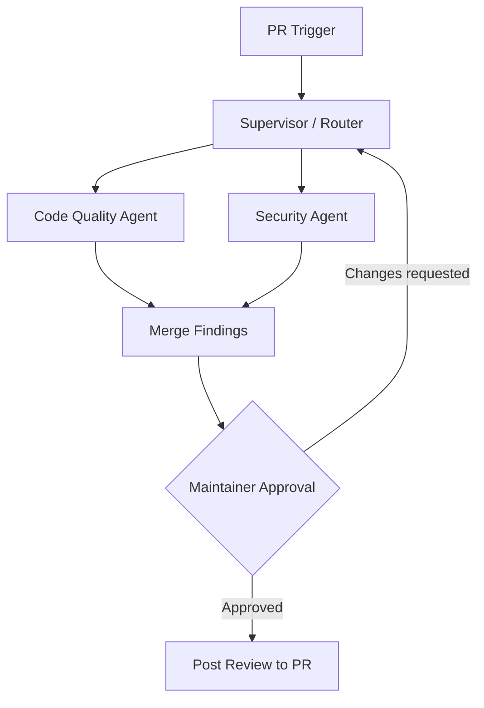

# ReviewForge

[](https://github.com/mahsa-teimourikia/multi-agent-pr-reviewer/actions/workflows/ci.yml)

ReviewForge is an open-source, LangGraph-powered multi-agent pull request reviewer. It is designed to inspect incoming GitHub PRs, combine focused security and code-quality findings, and request maintainer approval before publishing a review.

## Project roadmap

This repository is built in independently reviewable steps:

1. **Foundation** — `uv` packaging, quality tooling, configuration contract, and project documentation.
2. **Review graph** — typed state, supervisor routing, security agent, and style/logic agent.
3. **GitHub integration** — PR webhook/event input, diff retrieval, and review publishing.
4. **Human-in-the-loop** — durable pause/resume approval before any GitHub write.
5. **Production hardening** — tests, CI, deployment guidance, and contributor documentation.

## Architecture



The graph will carry a typed review state containing the PR metadata, diff, findings, approval decision, and final review body. The approval boundary is intentionally placed before the GitHub write node.

## Human approval

`build_review_workflow()` uses a durable LangGraph interrupt. Store the returned `thread_id` with the pending review, show the interrupt payload to a repository maintainer, and resume the same thread with an explicit decision:

```python
from langgraph.types import Command

pending = workflow.invoke(initial_state, {"configurable": {"thread_id": "pr-42"}})
workflow.invoke(Command(resume={"approved": True}), {"configurable": {"thread_id": "pr-42"}})
```

The GitHub publisher is never called until the approval value is `True`.

## Connecting GitHub

For a `pull_request` webhook, pass the JSON payload and a configured `GitHubClient` to `start_review_from_event`. ReviewForge fetches the diff, runs the specialist graph, and returns an approval interrupt. Persist the thread ID and resume it only after your maintainer UI records an approval decision. A GitHub App or fine-grained token with pull request read/write permission can be used by the adapter.

## Setup and local run

### Prerequisites

- Python 3.11 (the verified local runtime)
- [uv](https://docs.astral.sh/uv/)
- A GitHub token or GitHub App installation token with pull request read/write access
- An OpenAI API key

### Install

```bash
git clone https://github.com/mahsa-teimourikia/multi-agent-pr-reviewer.git
cd multi-agent-pr-reviewer
cp .env.example .env
make install-dev
```

Edit `.env` and set every value below. Generate unique secrets; never commit `.env`:

```dotenv
OPENAI_API_KEY=your-openai-api-key
GITHUB_TOKEN=your-github-token
GITHUB_REPOSITORY=owner/repository
GITHUB_WEBHOOK_SECRET=$(openssl rand -hex 32)
APPROVAL_TOKEN=$(openssl rand -hex 32)
CHECKPOINT_DB=reviewforge-checkpoints.sqlite
```

### Verify the installation

```bash
make check
uv run reviewforge
```

`make check` runs Ruff, strict mypy, pip-audit, and the test suite. The `reviewforge` command is a smoke-test CLI; the webhook server is started separately.

### Start the server

```bash
uv run reviewforge-server
```

The server listens on `http://localhost:8000`. Confirm it is running:

```bash
curl http://localhost:8000/healthz
# {"status":"ok"}
```

The server persists paused review state and webhook delivery IDs in the SQLite file configured by `CHECKPOINT_DB`.

### Configure the GitHub webhook

In the repository’s **Settings → Webhooks → Add webhook**:

1. Set **Payload URL** to `https://your-host.example.com/webhooks/github`.
2. Set **Content type** to `application/json`.
3. Set **Secret** to the exact value of `GITHUB_WEBHOOK_SECRET`.
4. Select **Let me select individual events**, enable **Pull requests**, and save.

ReviewForge processes `opened`, `synchronize`, and `reopened` pull request actions. Other events are acknowledged and ignored.

### Review and approve a pending PR

After a webhook arrives, inspect the generated review:

```bash
curl http://localhost:8000/reviews/owner/project/42 \
  -H "Authorization: Bearer $APPROVAL_TOKEN"
```

Approve it to publish the GitHub review, or set `approved` to `false` to reject it:

Webhook requests are acknowledged after the payload is written to a durable SQLite review queue. A worker drains pending jobs, retries transient failures up to two times, and resumes queued work after a process restart. For multiple server instances or high-volume production deployments, use a shared database and a dedicated queue service with a single worker lease per job.

```bash
curl -X POST http://localhost:8000/reviews/owner/project/42/approval \
  -H "Authorization: Bearer $APPROVAL_TOKEN" \
  -H 'Content-Type: application/json' \
  -d '{"approved":true}'
```

The approval endpoint requires `APPROVAL_TOKEN`. The server stores LangGraph checkpoints in SQLite at `CHECKPOINT_DB` (default: `reviewforge-checkpoints.sqlite`), so paused reviews survive normal process restarts. For multiple server instances, use a shared production database/checkpointer implementation.

## Container deployment

```bash
docker build -t reviewforge:local .
docker run --rm -p 8000:8000 \
  -e OPENAI_API_KEY \
  -e GITHUB_TOKEN \
  -e GITHUB_WEBHOOK_SECRET \
  -e APPROVAL_TOKEN \
  -v "$PWD/data:/data" \
  reviewforge:local
```

The image runs as a non-root user, persists checkpoints under `/data`, and exposes a Docker health check through `/healthz`.

Pushing a tag such as `v0.1.0` publishes versioned and `latest` images to GitHub Container Registry through the release workflow.

## Development

```bash
make install-dev  # create/sync the uv environment
make check        # lint and test
make format       # format source and tests
uv run reviewforge # print the CLI status message
```

## License

MIT. See [LICENSE](LICENSE).
